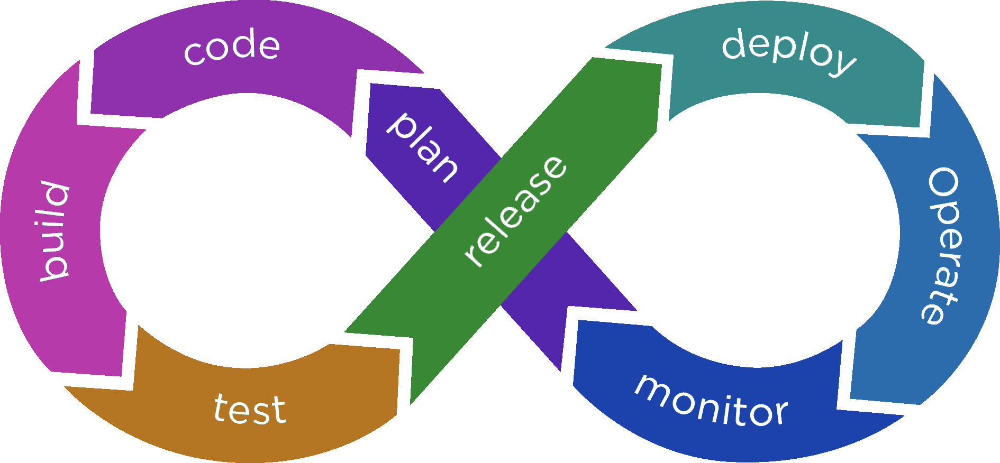

# learning devops

This is my journey on learning devops. In this repo I will publish all of my experiences and access to learning materials that I have found useful. 

Firstly I have enrolled in `A Cloud Guru` for a lot of the training materials and yes, it is initially bias to the world of AWS and devops.

I have also started to read review and understand the 90 days of devops: start here - 

I also love this devops road map - https://roadmap.sh/devops, it lists the key areas that as a devops engineer I need to focus on:
- Programming Language
- Different OS Concepts
- Learn how to manage servers 
- Live in the terminal
- Networking
- Networking Security Protocols
- IAC 
- CI CD
- Containers 
- CT management 
- CT orchestration 
- Monitoring 
- Cloud 
- Keep Learning

